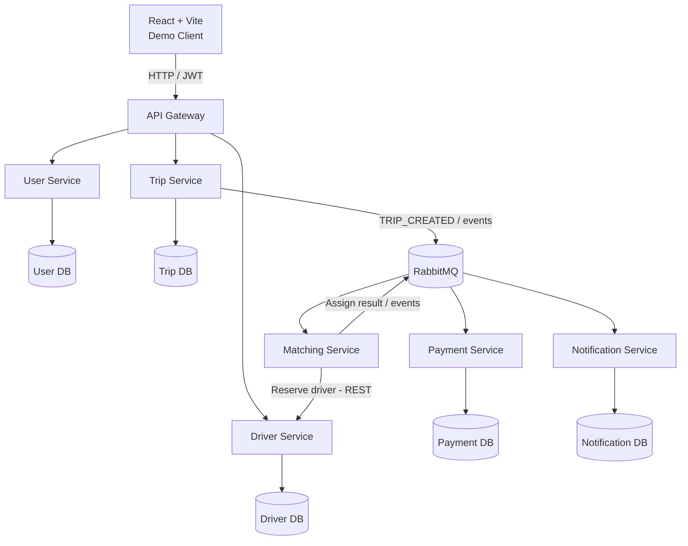
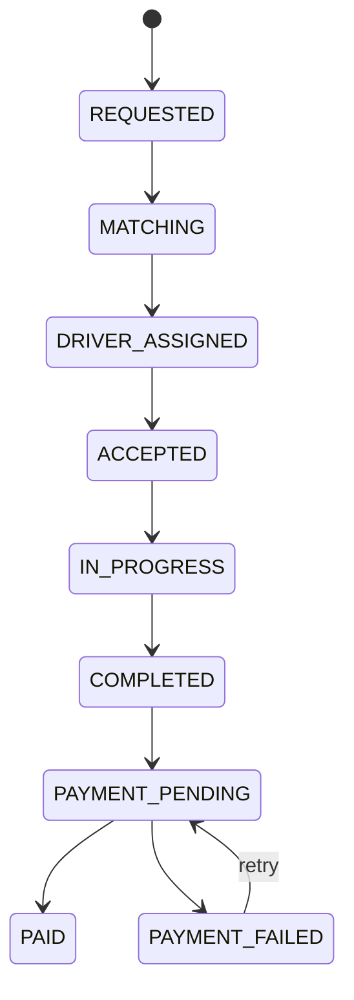
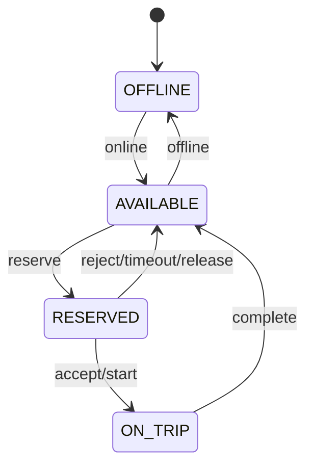
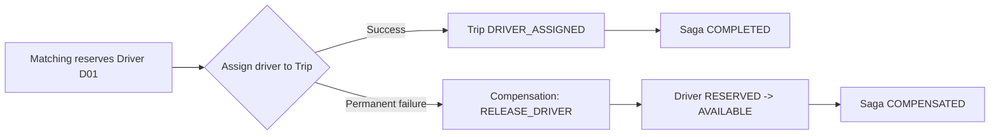
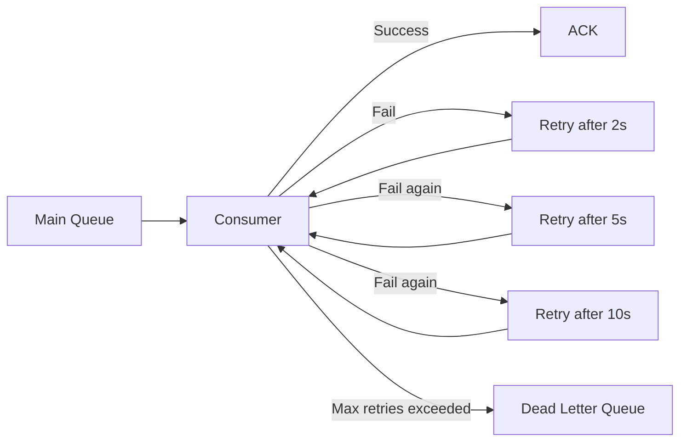

# DS03 – Ride-Hailing Microservices System

## Kế hoạch triển khai & thiết kế hệ thống

**Học phần:** Distributed Systems  
**Mô phỏng:** Grab/Uber  
**Phiên bản:** Revised Plan 1.0  
**Ngày cập nhật:** 26/09/2026  
**Deadline source code + report:** 22/11/2026  
**Định hướng:** ưu tiên luồng phân tán, concurrency, fault tolerance và khả năng demo.

> Tài liệu này được làm lại từ kế hoạch ban đầu và đã tinh gọn phần giao diện theo trao đổi với giảng viên.
>
> **Vai trò trong repository:** đây là `Project Plan`, dùng để mô tả phạm vi, roadmap, test/demo plan và cách triển khai dự án. Kiến trúc chi tiết nằm trong `architecture.md`.


# 1. Mục tiêu và định hướng triển khai

Mục tiêu của nhóm không phải xây dựng một ứng dụng gọi xe hoàn chỉnh ở mức sản phẩm thương mại, mà là xây dựng một prototype có thể chứng minh rõ các vấn đề cốt lõi của hệ thống phân tán: giao tiếp giữa các service độc lập, xử lý đồng thời, quản lý trạng thái phân tán, tính nhất quán, retry, idempotency, fault tolerance, recovery và distributed transaction.

Theo trao đổi với giảng viên, giao diện không phải trọng tâm. Vì vậy frontend được thu gọn thành một Demo Client để kích hoạt luồng nghiệp vụ và quan sát trạng thái. Thời gian và độ phức tạp được chuyển sang các cơ chế backend có giá trị trực tiếp khi demo và vấn đáp.

| **Nhóm hạng mục**      | **Ưu tiên** | **Định hướng**                                                                           |
|------------------------|-------------|------------------------------------------------------------------------------------------|
| Frontend/UI            | Thấp        | Chỉ làm đủ để thao tác Passenger, Driver và quan sát trạng thái/log.                     |
| Core business          | Trung bình  | Đủ happy flow: request ride → matching → accept → trip → payment.                        |
| Distributed mechanisms | Rất cao     | RabbitMQ, idempotency, retry/DLQ, correlation ID, atomic reservation, Saga/compensation. |
| Testing & failure demo | Rất cao     | Concurrency test, service failure, duplicate event, recovery, performance.               |
| Report & defense       | Cao         | Mọi cơ chế phải có sơ đồ, log, test evidence và giải thích được lựa chọn thiết kế.       |

## 1.1. Các thay đổi chính so với kế hoạch cũ

- Rút roadmap từ 10 tuần xuống 8 tuần để khớp deadline 22/11/2026; đặt feature freeze vào khoảng 15/11.

- Giảm mạnh phạm vi React; không làm bản đồ thật, animation, responsive phức tạp hoặc UI giống Grab.

- Đưa RabbitMQ và event contract vào sớm từ tuần 2 thay vì đến tuần 6 mới tích hợp.

- Định nghĩa rõ state machine cho Trip và Driver trước khi code nghiệp vụ.

- Chốt concurrency control bằng atomic/conditional update khi reserve driver.

- Chuyển Saga chính sang luồng Matching/Driver reservation để compensation rõ ràng và dễ bảo vệ.

- Deduplication được lưu persistent thay vì dùng Set trong RAM.

- Retry/DLQ có số lần thử, khoảng delay và tiêu chí chuyển DLQ cụ thể.

- Tách rõ test concurrency, reliability, security và performance.

# 2. Phạm vi chức năng

Phạm vi được chia thành Mandatory Core và Optional. Nhóm chỉ mở rộng Optional khi toàn bộ mandatory flow, failure cases và test evidence đã ổn định.

| **Phạm vi**             | **Chức năng**                                                                 | **Mức độ**                |
|-------------------------|-------------------------------------------------------------------------------|---------------------------|
| Identity/User           | Đăng ký, đăng nhập, role Passenger/Driver; JWT                                | Bắt buộc                  |
| Driver                  | Online/offline, trạng thái, vị trí giả lập, reserve/accept/reject             | Bắt buộc                  |
| Trip                    | Tạo yêu cầu chuyến, vòng đời chuyến, trạng thái thanh toán                    | Bắt buộc                  |
| Matching                | Tìm driver khả dụng, reserve driver atomically, chọn driver khác khi thất bại | Bắt buộc                  |
| Payment                 | Thanh toán giả lập success/fail; không tích hợp cổng thanh toán thật          | Bắt buộc                  |
| Notification            | Consume event và lưu/thể hiện thông báo giả lập                               | Bắt buộc                  |
| Demo Client             | Passenger panel, Driver panel, System Monitor                                 | Bắt buộc                  |
| Map/GPS thật            | Google Maps, GPS streaming, route visualization                               | Ngoài phạm vi             |
| Kubernetes/Service Mesh | Triển khai nâng cao                                                           | Chỉ làm nếu còn thời gian |
| Dynamic pricing         | Surge pricing phức tạp                                                        | Optional                  |

## 2.1. Giao diện tối thiểu phục vụ demo

Frontend được coi là Distributed Ride-Hailing Demo Client. Ba màn/panel chính là đủ:

- Passenger Panel: nhập pickup/destination giả lập, gửi request ride, xem Trip ID, Driver và trạng thái chuyến.

- Driver Panel: online/offline, cập nhật location giả lập, nhận trip, Accept/Reject, Start/Complete trip.

- System Monitor: hiển thị state transition, correlationId, event chính và trạng thái lỗi/retry phục vụ demo.

Không cần bản đồ đẹp. Pickup/destination có thể là latitude/longitude hoặc danh sách điểm giả lập cố định. Điều quan trọng là request tạo ra đúng distributed flow và có evidence trong log.

# 3. Yêu cầu kỹ thuật bám đề DS03

| **Yêu cầu**                      | **Cách đáp ứng trong dự án**                                                       |
|----------------------------------|------------------------------------------------------------------------------------|
| Ít nhất 4 business microservices | User, Driver, Trip, Matching, Payment, Notification.                               |
| REST/gRPC flow                   | Gateway → User/Driver/Trip và Matching → Driver dùng REST.                         |
| Asynchronous message queue       | RabbitMQ cho TRIP_CREATED, DRIVER_MATCHED, PAYMENT_REQUESTED, notification events. |
| Event ID / Idempotency key       | Mỗi event có eventId UUID; consumer lưu processed_event.                           |
| Retries                          | Bounded retry cho consumer và service calls có thể retry an toàn.                  |
| Deduplication                    | Kiểm tra eventId trước xử lý; unique constraint trên processed_event.              |
| DLQ / error storage              | Retry vượt giới hạn chuyển Dead Letter Queue.                                      |
| Correlation ID                   | Một correlationId đi xuyên suốt business flow và log.                              |
| Distributed transaction          | Saga/compensation trong luồng reserve driver → assign trip.                        |
| Concurrency                      | Hai passenger cùng tranh một driver; chỉ một reserve thành công.                   |
| Fault tolerance / recovery       | Tắt Notification/Payment/Matching service, chứng minh retry/queue/recovery.        |
| Security                         | JWT, RBAC, password hashing, input validation, env secrets.                        |
| Performance experiment           | k6: 10/50/100 concurrent trip requests; latency, P95, throughput, success rate.    |

# 4. Kiến trúc tổng thể

Kiến trúc ưu tiên sự rõ ràng khi demo: API Gateway cho request đồng bộ từ client; RabbitMQ cho luồng bất đồng bộ; mỗi service sở hữu dữ liệu của mình và không truy cập database của service khác.



*Hình 1. Kiến trúc tổng thể đề xuất cho DS03*

## 4.1. Trách nhiệm của từng service

| **Service**          | **Trách nhiệm chính**                                                           | **Dữ liệu sở hữu**                                   |
|----------------------|---------------------------------------------------------------------------------|------------------------------------------------------|
| API Gateway          | Routing, auth filter, propagate correlationId. Không chứa business logic.       | Không bắt buộc DB                                    |
| User Service         | User, credential, role Passenger/Driver, profile cơ bản.                        | users, roles                                         |
| Driver Service       | Driver status, simulated location, current trip, atomic reservation.            | drivers, driver_status_history                       |
| Trip Service         | Nguồn sự thật của Trip lifecycle; nhận kết quả matching/payment.                | trips, trip_status_history                           |
| Matching Service     | Nhận TRIP_CREATED, tìm candidate, gọi Driver Service reserve. Có thể stateless. | Không bắt buộc; nếu lưu thì matching_attempt/history |
| Payment Service      | Thanh toán giả lập và publish kết quả.                                          | payments                                             |
| Notification Service | Consume event và tạo notification giả lập.                                      | notifications, processed_event                       |

## 4.2. Database ownership

Nguyên tắc bắt buộc: service nào sở hữu dữ liệu thì chỉ service đó được đọc/ghi trực tiếp. Service khác muốn lấy dữ liệu phải gọi API hoặc sử dụng event. Không JOIN chéo DB và không dùng repository của service khác.

```
ĐÚNG:

Trip Service --REST/Event--> Driver Service --> Driver DB


SAI:

Trip Service --> DriverRepository --> Driver DB
```

## 4.3. Service naming/discovery

Không cần thêm Eureka/Consul nếu thời gian ngắn. Với Docker Compose, service name có thể đóng vai trò network name/DNS, ví dụ http://driver-service:8080. Nhóm cần mô tả rõ cơ chế này trong report như một lựa chọn service discovery/naming ở phạm vi prototype.

# 5. Thiết kế giao tiếp Sync và Async

| **Luồng**                           | **Kiểu giao tiếp**    | **Lý do**                                                                        |
|-------------------------------------|-----------------------|----------------------------------------------------------------------------------|
| Client → Gateway → User/Driver/Trip | REST synchronous      | Client cần response trực tiếp cho thao tác người dùng.                           |
| Matching → Driver reserve           | REST synchronous      | Matching cần biết ngay reserve thành công hay thất bại để chọn driver tiếp theo. |
| Trip → Matching                     | RabbitMQ asynchronous | Trip request không cần block trong khi matching xử lý; dễ retry/recovery.        |
| Matching → Trip/Notification        | RabbitMQ asynchronous | Tách producer/consumer và phục vụ event-driven flow.                             |
| Trip → Payment                      | RabbitMQ asynchronous | Payment là bước downstream có thể retry độc lập.                                 |
| Payment → Trip/Notification         | RabbitMQ asynchronous | Kết quả payment được propagate bằng event.                                       |

## 5.1. Event envelope thống nhất

Mọi event nên dùng một envelope thống nhất để hỗ trợ tracing, deduplication và versioning:

```json
{

"eventId": "uuid",

"eventType": "TRIP_CREATED",

"eventVersion": 1,

"correlationId": "uuid",

"occurredAt": "2026-10-10T12:00:00Z",

"producer": "trip-service",

"aggregateId": "TRIP_123",

"payload": { ... }

}
```

eventId dùng cho idempotency/deduplication; correlationId dùng để nối log từ nhiều service trong cùng một business flow; eventVersion cho phép thay đổi payload mà vẫn kiểm soát compatibility.

# 6. Quản lý trạng thái và consistency

Trước khi code API chi tiết, nhóm cần chốt state machine để mọi service hiểu giống nhau về trạng thái hợp lệ và transition nào được phép.



*Hình 2. Trip state machine đề xuất*



*Hình 3. Driver state machine đề xuất*

## 6.1. Business rules quan trọng

- Driver chỉ được reserve khi status = AVAILABLE.

- Driver ở RESERVED hoặc ON_TRIP không được gán cho trip khác.

- Trip chỉ chuyển DRIVER_ASSIGNED khi Driver Service đã reserve thành công.

- Nếu driver reject/timeout, phải release reservation trước khi chọn candidate tiếp theo.

- Payment failure không làm chuyến đã hoàn thành biến thành CANCELLED; giữ PAYMENT_FAILED/PENDING và xử lý retry.

- Mọi consumer phải kiểm tra trạng thái hiện tại trước khi áp dụng event để giảm lỗi out-of-order.

# 7. Concurrency control – hai passenger tranh cùng driver

Đây là concurrency scenario trọng tâm. Không dùng cách đọc AVAILABLE rồi mới update bằng hai câu lệnh tách rời vì có race condition. Nên dùng conditional update/compare-and-set ở database của Driver Service.

```sql
UPDATE drivers

SET status = 'RESERVED', current_trip_id = :tripId

WHERE id = :driverId

AND status = 'AVAILABLE';


affectedRows = 1 -> reserve thành công

affectedRows = 0 -> driver đã bị request khác lấy; chọn candidate khác
```

Kịch bản demo: P01 và P02 gửi request gần như đồng thời vào cùng D01. Chỉ một update trả affectedRows = 1. Request còn lại phải chọn D02 hoặc báo không còn driver. Sau demo cần hiển thị DB/log để chứng minh D01 không thể thuộc hai trip.

## 7.1. Concurrency test tối thiểu

| **ID** | **Test**                                                    | **Expected result**                                                           |
|--------|-------------------------------------------------------------|-------------------------------------------------------------------------------|
| C01    | Hai passenger cùng reserve D01                              | Chỉ một request reserve D01 thành công; request còn lại fallback driver khác. |
| C02    | Hai thao tác accept/assign cạnh tranh trên cùng driver/trip | State transition hợp lệ chỉ xảy ra một lần; dữ liệu cuối cùng nhất quán.      |
| R03    | Cùng eventId được publish 2 lần                             | Business effect chỉ xảy ra một lần; lần thứ hai bị dedup.                     |

# 8. Distributed transaction – Saga/Compensation

Saga chính nên đặt ở luồng matching/reservation vì có hành động bù tự nhiên và dễ giải thích. Payment vẫn có retry/failure state nhưng không nên dùng ví dụ “trip đã completed rồi payment fail thì cancel trip”, vì đó không phải compensation hợp lý.



*Hình 4. Saga compensation khi reserve driver thành công nhưng assign trip thất bại*

Ví dụ: Matching reserve D01 thành công. Nếu Trip Service không thể cập nhật DRIVER_ASSIGNED do timeout/lỗi, hệ thống phát hành RELEASE_DRIVER. Driver Service chuyển D01 từ RESERVED về AVAILABLE. Đây là compensating action khôi phục resource về trạng thái có thể sử dụng.

# 9. Reliability – Idempotency, Retry, DLQ và out-of-order

## 9.1. Persistent deduplication

Không dùng Set trong memory làm nguồn duy nhất vì restart service sẽ mất lịch sử. Mỗi consumer cần bảng processed_event hoặc cơ chế tương đương với unique constraint theo eventId.

```
processed_event

- event_id PK / UNIQUE

- consumer_name

- processed_at

- result_status
```

Quy trình: nhận event → kiểm tra eventId → nếu đã có thì ACK/ignore → nếu chưa có thì xử lý business → ghi processed_event trong transaction phù hợp → ACK.

## 9.2. Retry và Dead Letter Queue



*Hình 5. Bounded retry và Dead Letter Queue*

Tham số retry có thể điều chỉnh, nhưng phải chốt trong cấu hình và report. Một cấu hình demo dễ hiểu: 3 lần retry với delay 2s, 5s, 10s; vượt giới hạn thì chuyển DLQ. Khi service phục hồi, nhóm có thể re-drive message từ DLQ hoặc cung cấp script/manual action để retry lại.

## 9.3. Out-of-order event

Consumer không chỉ dựa vào thứ tự message. Nên kiểm tra current state/version trước khi transition. Ví dụ PAYMENT_SUCCEEDED chỉ hợp lệ khi trip đang PAYMENT_PENDING/PAYMENT_FAILED; event cũ hoặc không phù hợp sẽ được log và bỏ qua hoặc đưa error storage.

# 10. Failure model và recovery

| **Failure**                        | **Expected behavior**                                                         | **Evidence khi demo**                                               |
|------------------------------------|-------------------------------------------------------------------------------|---------------------------------------------------------------------|
| Notification Service down          | Event vẫn nằm trong queue/retry; trip flow không bị rollback vì notification. | RabbitMQ queue depth + retry log; restart service rồi consume tiếp. |
| Matching Service down              | Trip giữ REQUESTED/MATCHING; event không mất.                                 | TRIP_CREATED còn trong queue; restart matching xử lý tiếp.          |
| Driver Service timeout khi reserve | Matching retry có giới hạn hoặc chọn candidate khác tùy loại lỗi.             | Log timeout + candidate fallback.                                   |
| Trip update fail sau khi reserve   | Phát RELEASE_DRIVER compensation.                                             | Driver RESERVED → AVAILABLE.                                        |
| Duplicate message                  | Dedup theo eventId.                                                           | processed_event và log duplicate ignored.                           |
| Service restart                    | Business state lấy lại từ DB, event chưa ACK được broker giao lại.            | Restart container và flow tiếp tục.                                 |
| Invalid message                    | Reject/route error/DLQ, không làm consumer crash loop.                        | DLQ/error log.                                                      |

# 11. Security tối thiểu

| **Hạng mục**     | **Thiết kế**                                                                             |
|------------------|------------------------------------------------------------------------------------------|
| Authentication   | JWT sau đăng nhập; password hash bằng BCrypt/Argon2 tùy framework.                       |
| Authorization    | RBAC: Passenger không được gọi endpoint dành cho Driver/Admin.                           |
| Input validation | Validate DTO, enum state, size/range latitude-longitude, reject payload lỗi.             |
| Secrets          | Không commit token/password; dùng .env.example và environment variables.                 |
| Service boundary | Không expose database; chỉ API/message broker.                                           |
| Logging          | Không log password/token đầy đủ; log correlationId, eventId, service, timestamp, result. |
| Message size     | Giới hạn payload phù hợp, không gửi file lớn qua event.                                  |

Security test nên có cả 401 và 403. Ví dụ: Invalid JWT → 401; Passenger JWT gọi POST /drivers/{id}/status → 403; invalid payload → 400.

# 12. Thiết kế Demo Client

Mục tiêu UI là giúp giảng viên nhìn thấy “ai kích hoạt gì” và “hệ thống phân tán phản ứng như thế nào”. Có thể làm một trang React duy nhất chia thành 3 panel, tránh tốn thời gian routing/CSS.

| **Panel**      | **Control tối thiểu**                           | **Thông tin hiển thị**                                            |
|----------------|-------------------------------------------------|-------------------------------------------------------------------|
| Passenger      | Request Ride, Cancel                            | Trip ID, pickup/destination, assigned driver, status.             |
| Driver         | Online/Offline, Accept, Reject, Start, Complete | Driver status, current trip, simulated location.                  |
| System Monitor | Refresh/auto-poll hoặc WebSocket optional       | Event type, service, correlationId, timestamp, retry/error state. |

Nếu thiếu thời gian, System Monitor có thể chỉ hiển thị business state còn log kỹ thuật xem trực tiếp bằng terminal/RabbitMQ Management UI. Swagger/Postman vẫn nên giữ làm công cụ dự phòng khi frontend lỗi.

# 13. Kịch bản demo bắt buộc và nên chuẩn bị

| **\#** | **Kịch bản**                 | **Điểm cần chứng minh**                                                                               |
|--------|------------------------------|-------------------------------------------------------------------------------------------------------|
| 1      | Happy flow                   | Driver available → Passenger request → Matching reserve → Driver accept → Complete → Payment success. |
| 2      | Concurrent requests          | P01 và P02 cùng tranh D01; chỉ một reserve thành công.                                                |
| 3      | Notification service failure | Tắt container, event retry/queue; restart và xử lý tiếp.                                              |
| 4      | Duplicate event              | Publish cùng eventId 2 lần; business effect chỉ một lần.                                              |
| 5      | Saga compensation            | Reserve driver thành công nhưng assign trip fail; RELEASE_DRIVER đưa driver về AVAILABLE.             |
| 6      | Payment failure              | Payment FAILED/PENDING; retry; không rollback trip đã completed.                                      |
| 7      | Service restart              | Restart một service và chứng minh state/event tiếp tục từ DB/broker.                                  |
| 8      | Security invalid data        | 401/403/400 với request không hợp lệ.                                                                 |

# 14. Test matrix

| **ID** | **Loại**      | **Test**                           | **Expected**                          |
|--------|---------------|------------------------------------|---------------------------------------|
| F01    | Functional    | Register passenger                 | Success                               |
| F02    | Functional    | Login                              | JWT returned                          |
| F03    | Functional    | Driver online + location           | AVAILABLE                             |
| F04    | Functional    | Create trip                        | REQUESTED/MATCHING                    |
| F05    | Functional    | Matching                           | Driver selected/reserved              |
| F06    | Functional    | Driver accept                      | ACCEPTED                              |
| F07    | Functional    | Start + complete trip              | COMPLETED                             |
| F08    | Functional    | Payment success                    | PAID                                  |
| C01    | Concurrency   | Two passengers same driver         | Only one reserves D01                 |
| C02    | Concurrency   | Conflicting state transition       | Only valid transition committed       |
| R01    | Recovery      | Notification down                  | Retry/queue and recover after restart |
| R02    | Recovery      | Trip assign failure after reserve  | Compensation releases driver          |
| R03    | Reliability   | Duplicate event                    | Processed once logically              |
| S01    | Security      | Invalid JWT                        | 401                                   |
| S02    | Security      | Wrong role                         | 403                                   |
| S03    | Security/Data | Invalid payload                    | 400                                   |
| P01    | Performance   | 10/50/100 concurrent trip requests | Measure avg/P95/throughput/success    |

# 15. Performance experiment

Không cần benchmark quá lớn. Dùng k6/JMeter hoặc script phù hợp để tạo cùng một workload có thể lặp lại.

| **Thông số**   | **Giá trị đề xuất**                                    |
|----------------|--------------------------------------------------------|
| Endpoint chính | POST /api/trips hoặc flow request ride giả lập         |
| Concurrency    | 10 → 50 → 100 virtual users/requests đồng thời         |
| Duration       | 30–60 giây mỗi mức hoặc số request cố định             |
| Metrics        | Average latency, P95 latency, throughput, success rate |
| System metrics | CPU/RAM tùy khả năng thu thập                          |
| Evidence       | k6 output + log service + cấu hình máy test            |

# 16. Tech stack đề xuất

Các mục dưới đây là đề xuất triển khai để giảm rủi ro; nhóm có thể thay framework tương đương nếu đã thống nhất công nghệ khác.

| **Layer**       | **Đề xuất**                                    | **Ghi chú**                                                         |
|-----------------|------------------------------------------------|---------------------------------------------------------------------|
| Frontend        | React + Vite                                   | Giữ đúng kế hoạch cũ; CSS tối giản.                                 |
| Backend         | Java Spring Boot                               | Phù hợp REST, RabbitMQ, validation, security và transaction.        |
| Gateway         | Spring Cloud Gateway hoặc gateway đơn giản     | Không tính là business microservice.                                |
| Database        | MySQL/PostgreSQL; schema/DB riêng theo service | Ưu tiên công nghệ nhóm quen; không cross-DB access.                 |
| Message broker  | RabbitMQ                                       | Có Management UI để demo queue/retry/DLQ.                           |
| Auth            | Spring Security + JWT                          | Role Passenger/Driver/Admin nếu cần.                                |
| Container       | Docker Compose                                 | Service name làm DNS; dễ fault injection bằng stop/start container. |
| API docs        | Swagger/OpenAPI                                | Dùng làm fallback demo.                                             |
| Load test       | k6 hoặc JMeter                                 | Lưu script trong scripts/ hoặc tests/.                              |
| Version control | GitHub                                         | Commit history và contribution của từng thành viên.                 |

# 17. Roadmap 8 tuần

Kế hoạch mới ưu tiên hoàn thành core distributed mechanisms sớm, tránh đến tuần cuối mới tích hợp message queue hoặc fault handling.

| **Tuần** | **Thời gian** | **Mục tiêu**                                                                           | **Deliverable**                                             |
|----------|---------------|----------------------------------------------------------------------------------------|-------------------------------------------------------------|
| 1        | 28/09–04/10   | Requirements + architecture + state machine + service/data ownership + event contract. | requirements.md, architecture.md, diagrams, task assignment |
| 2        | 05/10–11/10   | Skeleton toàn bộ service, Docker Compose, DB riêng, RabbitMQ, Gateway/JWT cơ bản.      | docker compose up chạy toàn bộ; producer/consumer sample    |
| 3        | 12/10–18/10   | User + Driver + Trip core; driver status/location; trip create.                        | REST APIs + DB migration + basic tests                      |
| 4        | 19/10–25/10   | Matching + atomic reservation + accept/reject + Notification.                          | Happy flow đến DRIVER_ASSIGNED/ACCEPTED                     |
| 5        | 26/10–01/11   | Payment + event-driven flow + Saga + idempotency + retry/DLQ + correlation ID.         | Distributed mechanisms hoạt động end-to-end                 |
| 6        | 02/11–08/11   | Concurrency, fault injection, recovery, security; hoàn thiện Demo Client tối giản.     | C01/C02, R01/R02, S01–S03 chạy được                         |
| 7        | 09/11–15/11   | Integration test, performance, bug fix, log/tracing, feature freeze.                   | Test evidence + k6 results + release candidate              |
| 8        | 16/11–22/11   | Report, README, slides, demo script, oral rehearsal, final tag.                        | report.pdf, source, slides, v1.0.0                          |

Lưu ý: mid-term dự kiến 16/11. Vì vậy nên feature freeze trước hoặc trong ngày 15/11; tuần cuối không thêm công nghệ mới.

# 18. Gợi ý phân công cho nhóm 3 người

Bảng dưới là phương án cân bằng để mỗi người có phần backend/distributed rõ ràng trên GitHub. Thay “Member A/B/C” bằng tên thành viên thực tế.

| **Thành viên** | **Phần chính**                         | **Phần distributed cần hiểu/triển khai**                     | **Evidence**                  |
|----------------|----------------------------------------|--------------------------------------------------------------|-------------------------------|
| Member A       | User, Gateway, Trip, Security          | Correlation ID, trip state machine, event publishing         | PR/commit + tests + API docs  |
| Member B       | Driver, Matching                       | Atomic reservation, concurrency control, Saga release driver | PR/commit + concurrent test   |
| Member C       | Payment, Notification, RabbitMQ config | Retry, DLQ, idempotent consumer, recovery                    | PR/commit + fault demo        |
| Cả nhóm        | Demo Client, integration, report       | End-to-end flow, performance, oral defense                   | Demo script + report sections |

# 19. Cấu trúc repository

```text
README.md

src/

user-service/

driver-service/

trip-service/

matching-service/

payment-service/

notification-service/

api-gateway/

frontend/

deploy/

docker-compose.yml

rabbitmq/

tests/

functional/

concurrency/

fault-recovery/

security/

performance/

scripts/

start-all.*

fault-injection.*

seed-data.*

docs/

requirements.md

architecture.md

report.pdf

slides.pdf

.env.example
```

README phải có cách chạy lại hệ thống từ đầu, demo scenarios và yêu cầu môi trường. Mỗi thành viên cần có commit history rõ ràng và nhóm nên tạo final tag/release v1.0.0.

# 20. Rủi ro và nguyên tắc cắt scope

| **Rủi ro**                               | **Cách xử lý**                                                                              |
|------------------------------------------|---------------------------------------------------------------------------------------------|
| Mất thời gian UI                         | Giữ UI tối giản; ưu tiên Swagger/Postman làm fallback.                                      |
| RabbitMQ tích hợp quá muộn               | Có broker + producer/consumer từ tuần 2.                                                    |
| Quá nhiều service nhưng service rỗng     | Giữ trách nhiệm rõ; Matching có thể stateless thay vì tạo DB vô nghĩa.                      |
| Saga khó giải thích                      | Dùng reserve driver/assign trip/release driver; không dùng payment rollback trip completed. |
| Retry gây xử lý trùng                    | Persistent dedup + eventId unique.                                                          |
| Demo phụ thuộc dữ liệu ngẫu nhiên        | Seed sẵn driver/passenger/location; demo script deterministically.                          |
| Thêm Kubernetes/Redis/Kafka vì “cho xịn” | Không thêm nếu không giải quyết requirement cụ thể.                                         |
| Một người làm gần hết                    | Chia service + test evidence + PR từ đầu, review chéo architecture.                         |

# 21. Checklist trước khi nộp/demo

- [ ] docker compose up có thể khởi động các service độc lập.

- [ ] Có ít nhất 4 business microservices và mỗi service không truy cập DB của service khác.

- [ ] Có một REST/gRPC flow và một RabbitMQ asynchronous flow.

- [ ] Event có eventId + correlationId; duplicate event được dedup.

- [ ] Retry có giới hạn và có DLQ/error storage.

- [ ] Saga compensation release driver chạy được.

- [ ] Hai passenger tranh cùng driver nhưng không double assignment.

- [ ] Có ít nhất 2 fault/recovery tests và service restart vẫn tiếp tục xử lý.

- [ ] JWT/RBAC/input validation và secret config đúng.

- [ ] Có 8 functional, 2 concurrency, 2 fault/recovery, 2 security/invalid-data, 1 performance experiment.

- [ ] Log có service/node, timestamp, event type/correlationId và result.

- [ ] README chạy lại được; .env.example không chứa secret.

- [ ] Report/slides/demo script khớp implementation thực tế.

- [ ] Mỗi thành viên có commit/PR và giải thích được overall architecture.

# 22. Căn cứ tài liệu

Tài liệu được biên soạn lại dựa trên hai file nhóm cung cấp:

- COURSE PROJECT SPECIFICATION – Course: Distributed Systems, đặc biệt Topic DS03, General Requirements, Testing/Evaluation và Required Deliverables.

- “phân tán.pdf” – roadmap, architecture, use case, activity flow và booking sequence ban đầu của nhóm.
